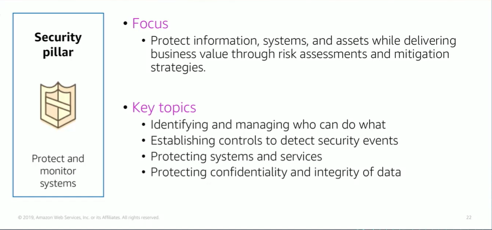

# Module 9: Security Pillar

Favorite: No
Archive: No
Notebook: AWS Cloud (../../AWS%20Cloud%2035b6c6880dca809b964ce3b71f757313.md)
Edited: June 1, 2026 1:58 PM
Created: June 1, 2026 1:47 PM

## Security Pillar

## Security Design Principles

- Implement a strong identity foundation; implement the principles of least privilege and enforce separation of duties with appropriate authorization for each interaction with your AWS resources.
- Traceability is where you monitor, alert, and audit actions and changes to your environment in real time. Integrate logs and metrics with systems to automatically respond and take action.
- Apply security at all layers; applying Defense-in-depth and apply security controls to all layers of your architecture, example, edge network, VPC, subnet, and load balance, and every instance, OS, and app.
- Automate security best practices is where you automate security mechanisms to improve ability to securely scale rapidly and cost effectively.
- Protect data in transit and at rest; classify data into sensitivity levels and use mechanisms such as encryption, tokenization, and access control where appropriate.
- Keep people away from data to reduce risk of loss or modification of sensitive data due to human error.
- Prepare for security events; this is where you have an incident management process that aligns with organizational requirements. Run incident response simulations and use tools with automation to increase your speed of detection, investigation, and recovery.

## Security Foundational Questions

